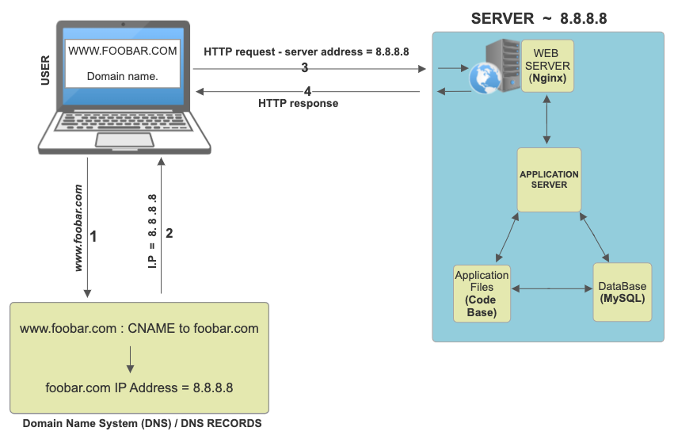
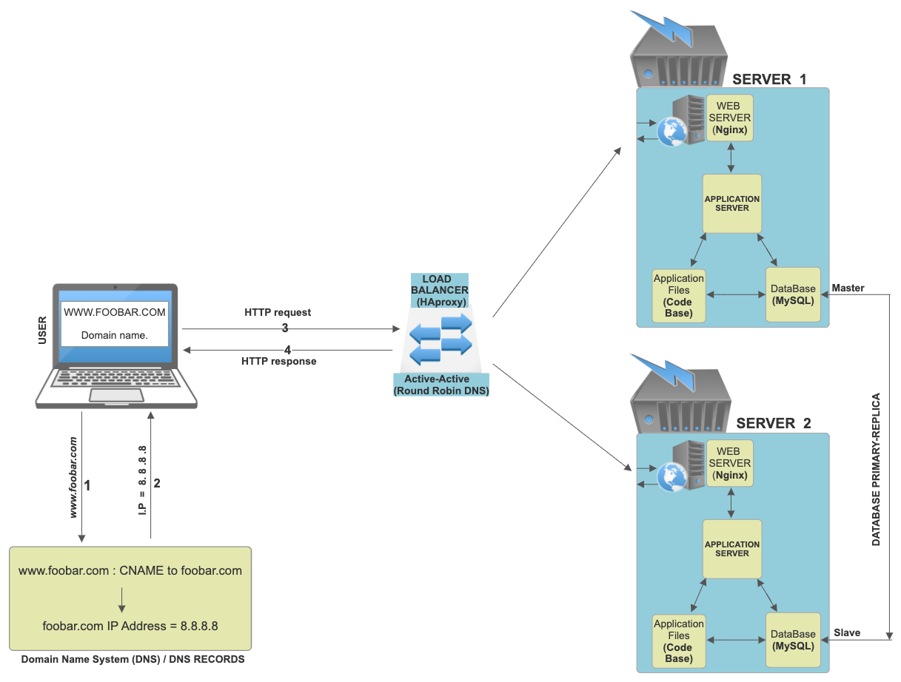
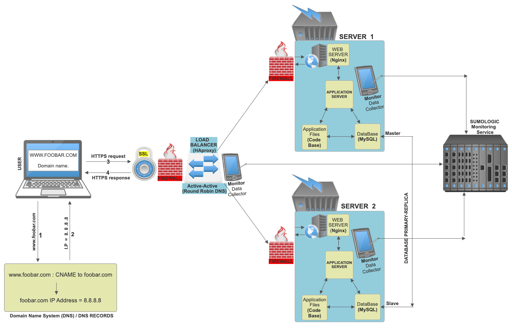
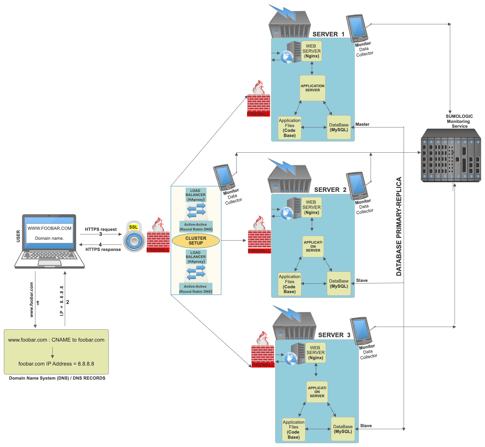

# 0x09. Web infrastructure design

## About this projecrt:
In this project we have Learnt about:
- Networking Basics
- DNS
- Databases
- Web servers
- Application servers
- DNS Record Types
- Fire walls
- Single Point Of Failure
- Monitoring
- Load Balancer
- HTTP and HTTPS
- LAMP stack
- Protocols, Packets, TCP/UP/IP
- Sub-Domain
- High Availabilty
- Ports 

At the end of this project we were able to explain, without the help of Google:
- You must be able to draw a diagram covering the web stack you built with the sysadmin/devops track projects
- You must be able to explain what each component is doing
- You must be able to explain system redundancy
- Know all the mentioned acronyms: LAMP, SPOF, QPS

## Task File Descriptions:
- Each file contains a link to an image diagram hosted on Google drive. 
- The diagrams are designs of a webserver infrastructure on different levels.
- Also in each file are text explaining some specifics and issues about each desgigns.

## [0-simple_web_stack](0-simple_web_stack)
On a whiteboard, design a one server web infrastructure that hosts the website that is reachable via `www.foobar.com.` Start your explanation by having a user wanting to access your website.  
You must use:
* 1 physical server
* 1 web server (Nginx)
* 1 application server
* 1 application files (your code base)
* 1 database (MySQL)
* 1 domain name `foobar.com` configured with a `www` record that points to your server IP `8.8.8.8`
You must be able to explain some specifics about this infrastructure:
* What is a server
* What is the role of the domain name
* What type of DNS record www is in www.foobar.com
* What is the role of the web server
* What is the role of the application server
* What is the role of the database
* What is the server using to communicate with the computer of the user requesting the website
You must be able to explain what the issues are with this infrastructure:
* SPOF
* Downtime when maintenance needed (like deploying new code web server needs to be restarted) Cannot scale if too much incoming traffic
### THE DESIGN : :beginner:

#### Specifics : :eight_pointed_black_star:
- User inputs the `**domain name**` www.foobar.com  into the computer browser.
`**The Domain name**`; www.Fobar.com, is a user friendly name used to link the IP address of the website.
The IP address is a series of numbers which are hard to memorize. eg. 127.345.456.4
The purpose of the domain name is to have a human user friendly representation of the website address.

- For the users computer to map the correct IP address to the domain name, the `**DNS**` system is used.
`**The Domain Name System(DNS)**` is a system that uses different process and resources to find the correct 
IP address of the domain name being queried. In the DNS system,  www.foobar.com is a cononical(alias) name record 
and subdomain of the main root domain name; foobar.com .The root domain name has an A record of 8.8.8.8, which is the IP Address.
Hence, the Cononical Name(name) www.foobar.com , points to the root domain name foobar.com which then points to the IP address 8.8.8.8.

- The IP address 8.8.8.8 is the address of the `**server**`(Nginx) storing the data details of the website www.foobar.com.
`**A server**` is a powerful computer, connected to the internet that provides different functions and services to the end users computers.
In these case, the server 8.8.8.8 is storing the webpage data and other webpage details of www.foobaar.com which the user is requesting to visit.

- The end user's computer brower using `**HTTP**` sends a request to the server for a response with the details of the www.foobar.com website.
`**Hyper Text Transfer protocols(HTTP)**` is a software both on the users computer browser and the end server computer which determines and controls
how the text files and other details of the webpage will be transferred between the two computers.

- `**The Web Server**` provides a static experience of responding and sending back to the client user the pre-stored text and data files of the webpage.
The files stored in HTML, CSS and JAVA script format will be sent back to end users computer browser and displayed as it was stored and designed.

- `**An application server**`  is a software used to provide additional services such as a dynamic web service, where the end user can also upload data
to the website while including so many other additional functions.
Here the application server can update, adjust, moderate, and install different datas and services on the website and computer systems to create a dynamic usage for
both end users of the website.

- The application server would make use of a `**database**`
`**A Database**` is a system that stores different forms of data. It allows the management, creation, updating, and retrieval of data. The Database also gives 
structure to organization business information. With the Data base, a **code base** and the application server, data of both client user and organization user
can be manipulated to create different forms of services.
#### Design Issues and faults: :triangular_flag_on_post:
- `**Single point of failure (SPOF)**`: Failure or malfunction of the server can lead to an entire failure of the system. To avoid this
a second server will be needed as a redundancy.

- `**Downtime**` : A single server can also cause downtime during maintenance, because users can’t access a server if it is offline during maintenance, restart, and update.

- `**scalability**` : Also a single server can affect scalability and downtime during high traffic, this can be resolved by adding a second server to share the traffic loads.

## [1-distributed_web_infrastructure](1-distributed_web_infrastructure)
On a whiteboard, design a three servers web infrastructure that host the website `www.foobar.com`.  
You must add to [0-simple_web_stack](0-simple_web_stack):
* 2 physical servers
* 1 web server (Nginx)
* 1 application server
* 1 load-balancer (HAproxy)
* 1 application files (your code base)
* 1 database (MySQL)
You must be able to explain some specifics about this infrastructure:
* For every additional element, why you are adding it
* What distribution algorithm your load balancer is configured with and how it works
* Is your load-balancer enabling an Active-Active or Active-Passive setup, explain the difference between both
* How a database Primary-Replica (Master-Slave) cluster works
* What is the difference between the Primary node and the Replica node in regard to the application
You must be able to explain what the issues are with this infrastructure:
* Where are SPOF
* Security issues (no firewall, no HTTPS)
* No monitoring
### THE DESIGN : :beginner:

#### Specifics : :eight_pointed_black_star:
The web infrastructure design is leveled up with an addition of further elements:

- `**Server 2**` : The server 2 comes in to enable a distribution of traffic in case of high traffic loads. This shares the traffic between server 1 and server 2, hence preventing a downtime failure of server one. Both servers will also serve as a back up during maintenance of either servers. This solves the SPOF challenge and increases high availability.

- `**Load Balancer**` : The load balancer handles the operation of how the two servers function and service the client. The load balancer using some algorithms, will distribute the work-load of each server to reduce the amount of load on an individual server, which in turn increases the reliability, efficiency and availability of the system.

- `**Active-Active setup**` : This Load balancer uses an Active-Active setup, which is a setup that distributes the work load across both active servers.  Another setup would be an Active-Passive setup which loads only one server, and leaves the other on standby, activating it on failure of the loaded server.

- `**ROUND ROBIN DNS**` : To enable the Active-Active setup, the ROUND ROBIN DNS algorithm is used, these algorithm handles the distribution of the loads by sequentially distributing the loads between the servers one after the other. Other algorithms like the LEAST CONNECTION FIRST SCHEDULING and the WEIGHTED SCHEDULING can be used.

- `**A Data-Base primary replica**` is introduced in this design. This element enables data from one database server (the master) to be replicated to one or more other database servers (the slaves), spreading the load among multiple slaves to improve performance, establish backups, and increase scalability of enormous queries. 
The `difference` between the the primary and replica is that the primary is the source data for the slave replica. Different algorithms are introduced to monitor differences between the data contents and establish updates of the slave from the master.

#### Design Issues and faults: :triangular_flag_on_post:
- `**SPOF**` is introduced at the LOAD BALANCER element, in an event where the load balancer fails, client and server won’t be able to communicate leading to a failure of the system.

- `**ssecurity**`: No `firewall` to monitor and limit if necessary any harmful types and sources of data being transmitted through the network. Also the HTTP protocol transmitting the website is not `secure`, meaning the text data being transmitted between the network, isn’t encrypted and can easily be accessed by an intruder.

- `**Monitoring**`: There its no form of monitoring on the systems server or software to notify of any sort of malfunctions or overload of servers.

## [2-secured_and_monitored_web_infrastructure](2-secured_and_monitored_web_infrastructure)
On a whiteboard, design a three servers web infrastructure that host the website `www.foobar.com`, it must be secured, serve encrypted traffic and be monitored.  
You must add to [1-distributed_web_infrastructure](1-distributed_web_infrastructure):
* 3 firewalls
* 1 SSL certificate to serve `www.foobar.com` over HTTPS
* 3 monitoring clients (data collector for Sumologic or other monitoring services)
You must be able to explain some specifics about this infrastructure:
* For every additional element, why you are adding it
* What are firewalls for
* Why is the traffic served over HTTPS
* What monitoring is used for
* How the monitoring tool is collecting data
* Explain what to do if you want to monitor your web server QPS
You must be able to explain what the issues are with this infrastructure:
* Why terminating SSL at the load balancer level is an issue
* Why having only one MySQL server capable of accepting writes is an issue
* Why having servers with all the same components (database, web server and application server) might be a problem
### THE DESIGN : :beginner:

#### Specifics : :eight_pointed_black_star:
The web infrastructure design is further leveled up with addition of other elements:

- `**Firewalls**`: Firewalls allow, limit, and block network traffic based on preconfigured rules in the hardware or software, analyzing data packets that request entry to the network. This provides internal protection to a network. It’s customizable, allowing users some control over its function and protection features, such as being able to block access to certain websites on the network. The firewalls is integrated at both servers and load balancers.

- `**HTTPS/SSL**` : HTTPS is a secured form of HTTP. Providing a secure and encrypted transmission of data between servers and user computers. Here , SSL (Secure Sockets Layer) protocol is used through an 'asymmetric' Public Key Infrastructure (PKI) system. An asymmetric system uses two 'keys' to encrypt communications, a 'public' key and a 'private' key. Anything encrypted with the public key can only be decrypted by the private key and vice-versa. When you request a HTTPS connection to a webpage, the website will initially send its SSL certificate to your browser. This certificate contains the public key needed to begin the secure session. Based on this initial exchange, your browser and the website then initiate the 'SSL handshake'. The SSL handshake involves the generation of shared secrets to establish a uniquely secure connection between yourself and the website.

- Terminating SSL certificate at the load balancer is a Security issue because: When SSL is terminated at the load balancer, traffic between the load balancer and the application servers is unencrypted. This increases the risk of data breaches and exposes sensitive information to potential attackers.

- `**Monitoring**` : A monitoring system collects health and performance data of servers, virtual machines, containers, databases, and other backend components in a tech stack. Engineers can use an infrastructure monitoring tool to visualize, analyze, and alert on metrics and understand whether a backend issue is impacting users.
Here the Sumo Logic's integrated analytics platform seamlessly correlates system issues measured by: performance monitoring, the deep visibility provided by logging, user experience monitoring provided by tracing and transaction analytics, and security visibility with integrated security analytics.

- `The monitoring tools collect data by` :
1. Log-based monitoring : streaming event logs and data, also known as log files, which the server generates automatically. On the server, log files provide information about issues, user activity, and security events.

2. SNMP-based monitoring: Simple Network Management Protocol (SNMP) is a standard protocol used to manage and monitor devices on a network. SNMP-based monitoring tools can query network devices and servers for data such as CPU usage, memory usage, and network traffic.

3. Agent-based monitoring: In this method, an agent software is installed on the server being monitored, which collects and sends metrics to the monitoring tool. The agent software can collect system-level data such as CPU usage, memory usage, disk usage, and network traffic, as well as application-level data such as QPS, response time, and error rates.

4. API-based monitoring: Some applications and servers provide APIs to access performance metrics. Monitoring tools can use these APIs to collect and monitor data such as QPS, response time, and error rates.

- Monitoring web server `QPS (Queries Per Second)` is an important task for any web server administrator. Queries per second is a measure of the rate of traffic going through a particular server in relation to a network that serves a Web domain. 

This measurement is important in assessing how support infrastructures handle changing amounts of Web traffic and whether systems are scalable enough to serve the changing needs of a user community as they grow. Assessing projects in terms of queries per second and other metrics serves the specific purpose of making sure that websites respond to users quickly and efficiently. These types of assessments and benchmarks are behind the idea that users can enter something into a website and get immediate updates. One major example is social media giant Facebook. Analysis of Facebook’s engineering efforts shows that the site can respond to a volume of well over 10 million queries per second, with response times measured in milliseconds.

Monitoring QPS helps to ensure that the server is running optimally and that any potential issues can be identified and addressed quickly. This can be done using open source tools, cloud based solutions, log analysis tools, Traffic monitoring tools.

#### Design Issues and faults: :triangular_flag_on_post:

- Having only one MYSQL server capable of accepting writes is an issue because :

1. Single Point Of Failure : if the master goes down, the application cannot write to the database anymore. Hence it is
good practice to configure some slave database to be able to do most of the master database functions.

2. Scalability limitations: With only one server accepting writes, you may encounter performance issues as the number of writes to the database increases.

3. High availability: If you need high availability for your application, having a single MySQL server accepting writes is not ideal. In the event of a failure, there is no automatic failover to a backup server.

## [3-scale_up](3-scale_up)
You must add to [2-secured_and_monitored_web_infrastructure](2-secured_and_monitored_web_infrastructure):
* 1 physical server
* 1 load-balancer (HAproxy) configured as cluster with the other one
* Split components (web server, application server, database) with their own server
You must be able to explain some specifics about this infrastructure:
* For every additional element, why you are adding it
### THE DESIGN : :beginner:

#### Specifics : :eight_pointed_black_star:
The web infrastructure design is further leveled up with addition of other elements:

- `Server 3` : The addition of another server improves the reliability of the infrastructure since more traffic can be handled and there is more redundancy in case of device failure.

- `Load Balancer 2` :  Another load balancer is added and configured as a cluster. This eleminates SPOF on the load balancer functionality, enabling high availability in
the case one fails.

#### Design Issues and faults: :triangular_flag_on_post:

Having servers with all the same components means that each server in the cluster has the same hardware and software configuration. For example, if you have a cluster of web servers, each web server would have the same hardware specifications such as CPU, RAM, and storage capacity, as well as the same software configuration, including the operating system, web server software, and any necessary libraries or dependencies.

The idea behind having servers with all the same components is to ensure consistency and reliability. It simplifies server management and configuration, as administrators only need to manage one configuration that can be replicated across all servers. This reduces the likelihood of errors or inconsistencies that can occur when managing multiple configurations.

Having servers with all the same components can also make it easier to scale out or horizontally. If you need to add more capacity to your infrastructure, you can simply add another server with the same configuration as the existing servers, and it will seamlessly integrate with the cluster.

However, having servers with all the same components also has some drawbacks. If there is a hardware or software issue that affects one server in the cluster, it can potentially affect all the other servers with the same configuration. Additionally, having all the servers with the same components can limit flexibility, as you may not be able to easily switch to different hardware or software configurations if needed.

Having servers with all the same components (database, web server and application server) might be a problem because their consumption will not grow the same way between each of them (we might want to have more database servers than application servers for instance).

Having servers with all the same components (database, web server and application server) might be a problem because when there is maintenance performed on a server for a specific component, it will affect other components that are on it

To fix this, add servers containing a single component inside them (such as a web server, application server or database)
